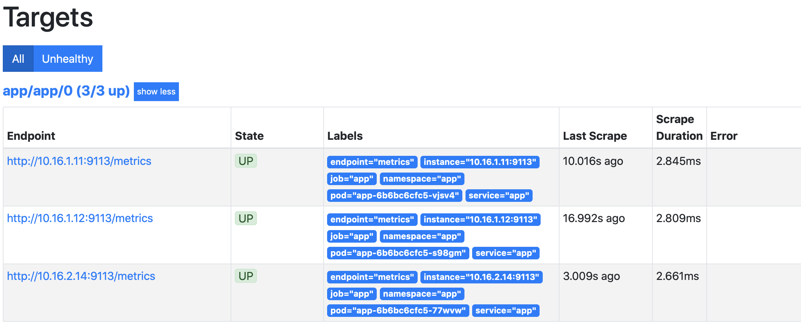

# ДЗ #8 к лекции #10 (kubernetes-monitoring)

## Создание кластера k8s
Для выполнения ДЗ будем использовать кластер kubernetes, развернутый в GKE.
```bash
gcloud beta container --project "test-lab" clusters create "monitoring-lab" --zone "europe-west1-d" --no-enable-basic-auth --cluster-version "1.14.10-gke.17" --machine-type "n1-standard-1" --image-type "COS" --disk-type "pd-standard" --disk-size "100" --scopes "https://www.googleapis.com/auth/devstorage.read_only","https://www.googleapis.com/auth/logging.write","https://www.googleapis.com/auth/monitoring","https://www.googleapis.com/auth/servicecontrol","https://www.googleapis.com/auth/service.management.readonly","https://www.googleapis.com/auth/trace.append" --num-nodes "3" --enable-stackdriver-kubernetes --enable-ip-alias --network "projects/apigee-test-lab/global/networks/default" --subnetwork "projects/apigee-test-lab/regions/europe-west1/subnetworks/default" --default-max-pods-per-node "110" --addons HorizontalPodAutoscaling,HttpLoadBalancing --enable-autoupgrade --enable-autorepair
```

## Установка prometheus-operator
Для установки prometheus-operartor будем использовать helm3. Так как установка производится в GKE кластере, то будем публиковать сервисы в интренет с помощью nginx-ingress.

Добавляем репозиторий с charts
```bash
helm repo add stable https://kubernetes-charts.storage.googleapis.com/
```

### Установка nginx-ingress

```bash
kubectl create ns nginx-ingress
helm upgrade --install nginx-ingress stable/nginx-ingress --namespace=nginx-ingress --version=1.29.5
```
Смотрим IP адрес контроллера ingress, он нам пригодится для указания имен хостов публикуемых сервисов.
```bash
kubectl get service -n nginx-ingress
```

### Установка prometheus-operator

Выбираем последнюю версию prometheus-operator
```bash
helm search repo -l stable/prometheus-operator | head -n 2
```

Сохраняем стандартный файл values.yaml в качестве справки
```bash
helm inspect values stable/prometheus-operator --version=8.5.14 > kubernetes-monitoring/prometheus-operator.values.yaml.default
```
В файле prometheus-operator.values.yaml добавляем описание Ingresses. В качестве имен используем сервис nip.io с указанием ранее найденого IP адреса ingress контроллера.
Кроме этого необходимо установим serviceMonitorSelectorNilUsesHelmValues в false (https://github.com/helm/charts/issues/11310#issuecomment-493525598)

Устанавливаем prometheus-operator
```bash
kubectl create ns monitoring
helm upgrade --install prometheus-operator stable/prometheus-operator --version=8.5.14 --namespace=monitoring -f kubernetes-monitoring/prometheus-operator.values.yaml
```
При уситановке получал сообщение info, что пропускаются CRD, к видимым последствиям это не привело. Как применить CRD до установки описано в статье https://github.com/helm/charts/tree/master/stable/prometheus-operator#coreos-crds

#### Проверка установки
По адресу grafana.*your_ip*.nip.io открывается Grafana. Стандартный пароль можно посмотреть в файле с переменными по умолчанию.
По адресу prometheus.*your_ip*.nip.io (на 80 порту) открывается prometheus. Alertmanager также открывается на 80 порту по адресу alertmanager.*your_ip*.nip.io

## Создание Docker образа

Создан Docker образ с добавлением stub_status по пути /stub_status на порту 8080. По пути / на порту 80 отдается hostname.

## Сбор метрик с nginx

### Создание deployment

Шаблон нового deployment можно создать с помощью команды
```bash
kubectl create ns app
kubectl create deployment app --image evgeniim/nginx-with-status:0.0.2 --dry-run -o yaml > kubernetes-monitoring/deployment.yaml
kubectl apply -f kubernetes-monitoring/deployment.yaml -n app
```
Node exporter запускается как sidecar контейнер.

### Создадим сервис
Шаблон сервиса для дальнейшей конфишгурации получим с помощью команды
```bash
kubectl create svc loadbalancer app --tcp=80:80 --tcp=9113:9113 --dry-run -o yaml > kubernetes-monitoring/service.yaml
kubectl apply -f kubernetes-monitoring/service.yaml -n app
```

#### Проверка работы сервиса
Получим ip адреса сервиса kubectl get service -n app
Посмотрим метрики сервиса curl *service_ip_address*:9113/metrics

### ServiceMonitor

Servicemonitor настроаивался согласно статьи https://github.com/coreos/prometheus-operator/blob/master/Documentation/user-guides/getting-started.md

```bash
kubectl apply -f kubernetes-monitoring/servicemonitor.yaml -n app
```

#### Проверка сбора метрик
В prometheus появились новые targets.

